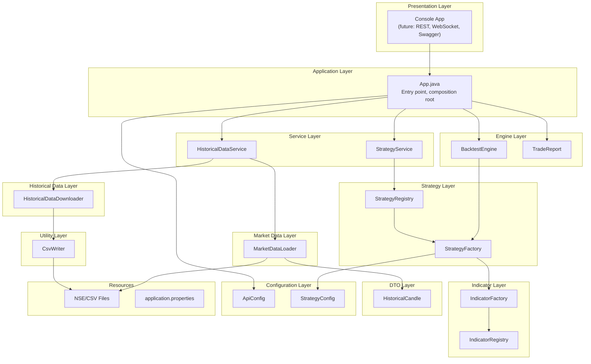
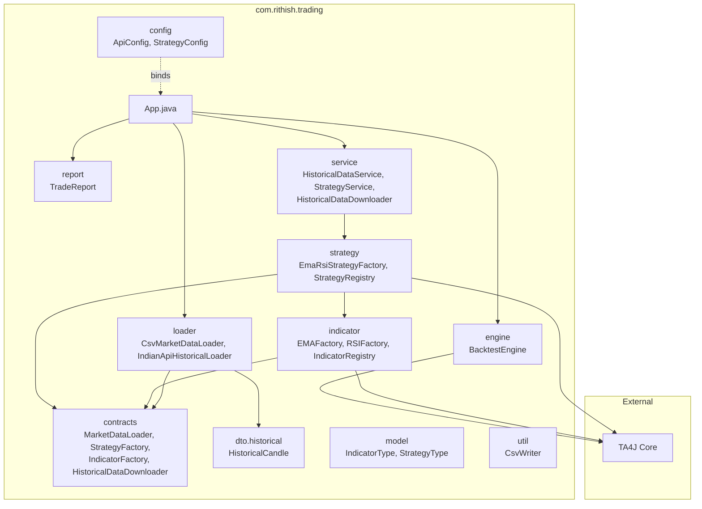
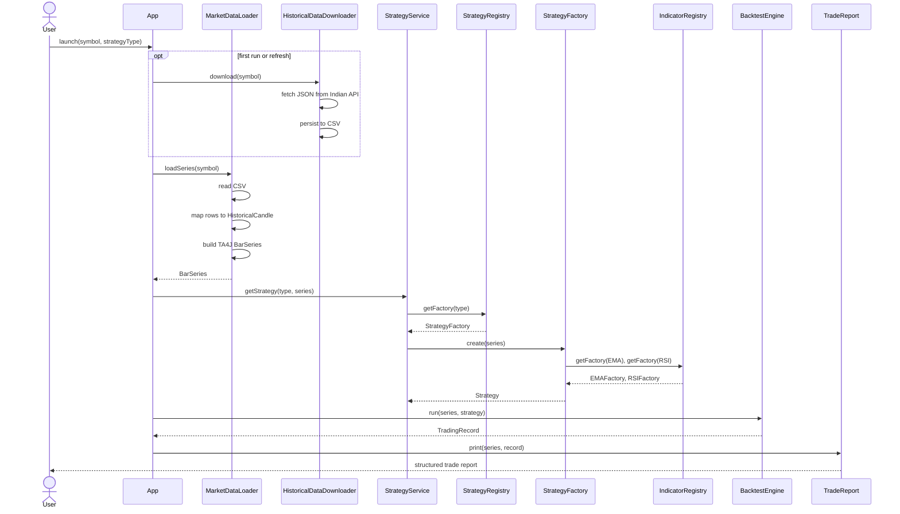
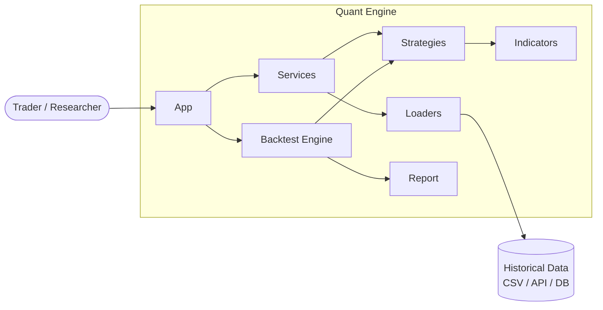
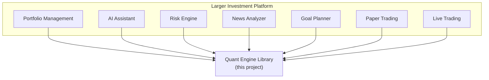

## 🎯 Vision
# Quantitative Trading Strategy Engine

> A production-style quantitative trading engine built in Java 21 using TA4J, designed as a reusable, modular, and extensible architecture for building, testing, and evaluating algorithmic trading strategies.


## Overview

This project is a quantitative trading engine inspired by the architecture used in professional trading desks. It loads historical market data, generates technical indicators, composes strategies, runs deterministic backtests, and produces structured trade reports.

Unlike a typical TA4J demo, every component here is deliberately isolated behind contracts, registered through factories, and wired together through services. The result is a codebase that is easy to extend without rewriting existing modules, and a foundation that can grow from a console application into a full research, optimisation, paper-trading, and live-execution platform.

## Vision

The long-term objective is to evolve this project into a complete quantitative trading platform that supports research and indicator experimentation, deterministic historical backtesting, parameter optimisation and walk-forward analysis, portfolio-level analytics, paper trading, and live algorithmic execution.

The engine is designed to be reused as a library inside a larger AI-powered investment platform that may also include risk analysis, news sentiment, goal-based planning, and portfolio management.

## Design Principles

The architecture is grounded in software engineering fundamentals rather than trading specifics.

- **Clean Architecture** — strict layering, dependencies point inward toward contracts.
- **SOLID** — every layer has a single responsibility and is open for extension but closed for modification.
- **Strategy Pattern** — trading strategies are interchangeable behaviours.
- **Factory Pattern** — indicators and strategies are instantiated through registries.
- **Interface-driven Design** — every collaborator is bound by an interface, never by a concrete class.
- **Loose Coupling, High Cohesion** — modules know only what their contract exposes.
- **Reusability, Scalability, Maintainability** — the engine is intended to be lifted into larger systems as a self-contained module.

## High-Level Architecture

The engine is organised into cooperating layers. Each layer talks to the layer below it only through the contracts exposed by `com.rithish.trading.contracts`.



## Package Diagram

The package layout mirrors the layered architecture and keeps each concern isolated.



## Data Flow

The end-to-end data flow is linear and deterministic. Each step transforms the data into a richer shape without leaking abstractions.



## Component View



## Module Breakdown

### Application Layer
`App` is the composition root. It selects the data source, picks the strategy from the registry, runs the backtest engine, and prints the report. It contains no business logic.

### Contracts Layer
The `contracts` package defines the boundaries of the system: `MarketDataLoader`, `StrategyFactory`, `IndicatorFactory`, and `HistoricalDataDownloader`. They enable dependency injection, make every collaborator swappable, and keep the engine framework-agnostic.

### Configuration Layer
`ApiConfig` and `StrategyConfig` isolate credentials, base URLs, indicator periods, and thresholds. Future iterations will read from YAML and environment variables. Isolation lets the same binary run in research, paper, and live modes without code changes.

### Historical Data Layer
`HistoricalDataDownloader` fetches OHLCV JSON from the Indian API and persists it to CSV through `CsvWriter`. Persisting to CSV is intentional — it makes backtests faster, deterministic, offline, repeatable, and independent of any third-party API.

### Market Data Layer
`CsvMarketDataLoader` reads CSV files, maps rows to `HistoricalCandle`, and assembles a TA4J `BarSeries`. Future loaders — Yahoo, Polygon, Twelve Data, Database, Cache — implement the same `MarketDataLoader` contract, so the engine always receives an identical `BarSeries`.

### DTO Layer
`HistoricalCandle` is a plain data carrier between the CSV and JSON boundary and TA4J. It keeps the loader free of TA4J types and lets the data shape evolve independently.

### Indicator Layer
`EMAFactory` and `RSIFactory` build indicators through the `IndicatorFactory` contract and are wired by `IndicatorRegistry`. The Factory Pattern is the single extension point: adding MACD, ATR, Bollinger Bands, VWAP, or Supertrend means adding a new factory and registering it — no existing code changes.

### Strategy Layer
`EmaRsiStrategyFactory` composes indicators into entry and exit rules and returns a TA4J `Strategy`. `StrategyRegistry` maps `StrategyType` enums to factories, so the engine never knows which strategy it is running. Adding a new strategy requires zero changes to `BacktestEngine`.

### Engine Layer
`BacktestEngine` accepts a `BarSeries` and a `Strategy` and returns a `TradingRecord`. It is intentionally ignorant of CSV, APIs, indicators, and UI — the engine can be reused unchanged inside a microservice, a CLI, or a notebook.

### Report Layer
`TradeReport` formats the `TradingRecord` for the console. Future iterations will export CSV, Excel, JSON, PDF, HTML, and chart visualisations.

### Service Layer
Services orchestrate business workflows: `HistoricalDataService` and `StrategyService` today; `RiskAnalysisService`, `OptimizationService`, and `PortfolioAnalysisService` later.

### Utility Layer
`CsvWriter` centralises serialisation. Future helpers will cover dates, files, numbers, and JSON.

## Current Features

- Modular project architecture with clear package boundaries
- `StrategyFactory` and `IndicatorFactory` contracts
- `StrategyRegistry` and `IndicatorRegistry` for runtime wiring
- EMA and RSI indicators with a registry-driven Factory
- EMA + RSI strategy with crossover and RSI threshold rules
- `BacktestEngine` powered by TA4J's `BarSeriesManager`
- `TradeReport` for completed trades and open positions
- CSV market data loader backed by the resources folder
- Stub `IndianApiHistoricalLoader` for future API integration
- Loose coupling — every collaborator is bound by an interface

## Planned Features

### Phase 1 — Data Foundation
Historical CSV loader (NSE, NASDAQ, BSE), Twelve Data API integration, Yahoo Finance loader, multiple timeframe support (1m, 5m, 15m, 1h, 1d).

### Phase 2 — Indicator Library
Moving Average, RSI, MACD, Volume, VWAP, ATR, Supertrend, CPR, Bollinger Bands.

### Phase 3 — Strategy Library
Swing trading, intraday, multi-indicator, and risk-managed strategies.

### Phase 4 — Portfolio Analytics
Win rate, CAGR, maximum drawdown, Sharpe ratio, Sortino ratio, expectancy.

### Phase 5 — Optimisation
Parameter sweeps, walk-forward analysis, Monte Carlo simulation.

### Phase 6 — Live Trading
Paper trading, real-time signal generation, broker integration.

## Project Structure

```
demo
├── pom.xml
├── .gitignore
└── src
    └── main
        ├── java
        │   └── com
        │       └── rithish
        │           ├── practice         (TA4J learning scratchpad)
        │           └── trading
        │               ├── App.java
        │               ├── config         (ApiConfig, StrategyConfig)
        │               ├── contracts      (MarketDataLoader, StrategyFactory, IndicatorFactory, HistoricalDataDownloader)
        │               ├── dto.historical (HistoricalCandle)
        │               ├── engine         (BacktestEngine)
        │               ├── indicator      (EMAFactory, RSIFactory, IndicatorRegistry)
        │               ├── loader         (CsvMarketDataLoader, IndianApiHistoricalLoader)
        │               ├── model          (IndicatorType, StrategyType)
        │               ├── report         (TradeReport)
        │               ├── service
        │               │   ├── downloader (HistoricalDataDownloader)
        │               │   └── impl       (HistoricalDataService, StrategyService)
        │               ├── strategy       (EmaRsiStrategyFactory, StrategyRegistry)
        │               └── util           (CsvWriter)
        └── resources
            └── historical
                └── NSE
                    ├── INFY.csv
                    ├── RELIANCE.csv
                    └── TCS.csv
```

## Technology Stack

- Java 21
- Maven
- TA4J 0.18 — core technical analysis engine
- Project Lombok
- Jackson — JSON parsing
- OkHttp 4.12 — HTTP client
- Logback — logging

## Getting Started

Prerequisites: JDK 21 and Maven 3.9+.

```bash
git clone https://github.com/<your-username>/quantitative-trading-strategy-engine.git
cd quantitative-trading-strategy-engine/demo
mvn clean compile
mvn exec:java -Dexec.mainClass="com.rithish.trading.App"
```

Place OHLCV CSV files under `src/main/resources/historical/NSE/` using the format `Date,Open,High,Low,Close,Volume`.

## SOLID Principles by Layer

| Layer | S — Single Responsibility | O — Open/Closed | L — Liskov Substitution | I — Interface Segregation | D — Dependency Inversion |
| --- | --- | --- | --- | --- | --- |
| Application | One entry point that composes dependencies | Strategies and loaders are pluggable | Substitutable via service abstractions | Narrow app-level interfaces | Depends on services, never concretes |
| Contracts | Pure interfaces, no behaviour | New implementations extend the system | Any implementation satisfies the contract | Cohesive per-purpose interfaces | Inversion: app depends on contracts |
| Configuration | Single source for each concern | Add new config files without code change | n/a | Cohesive config domains | Injected into the layers that need them |
| Loader | One transport per implementation | New loaders added without touching the engine | Any `MarketDataLoader` works | Just `loadSeries` per contract | Injected into the service |
| Indicator | One indicator per factory | Add a factory and register it | Any `IndicatorFactory` works | Minimal factory surface | Engine depends on `Indicator<Num>` |
| Strategy | One strategy per factory | Register a new `StrategyType` to add behaviour | Any factory output is a valid `Strategy` | Only `create(BarSeries)` | Engine depends on the contract |
| Engine | Only orchestrates a backtest | New engines (walk-forward, Monte Carlo) extend it | Any `Strategy` is acceptable | Single method: `run` | Inversion: receives inputs by contract |
| Report | One output format per class | Add new report formats freely | All formats accept the same record | Per-format interfaces | Engine knows nothing about reports |
| Service | One workflow per service | New services extend workflows | Substitutable collaborators | Minimal orchestration surface | Wires the contracts together |
| Utility | Stateless helpers | New helpers added freely | n/a | n/a | n/a |

## Extension Points

Adding new behaviour never requires modifying existing code.

- **New indicator** — implement `IndicatorFactory`, register in `IndicatorRegistry`, add a value to `IndicatorType`.
- **New strategy** — implement `StrategyFactory`, register in `StrategyRegistry`, add a value to `StrategyType`.
- **New data source** — implement `MarketDataLoader`, inject into `HistoricalDataService`.
- **New API** — implement `HistoricalDataDownloader`, add credentials to `ApiConfig`.
- **New risk rule** — add a `RiskAnalyzer` contract and inject it into the engine.
- **New report format** — add a `ReportGenerator` implementation.
- **New optimiser** — add an `Optimizer` contract and call the engine in a loop.
- **AI, portfolio, live trading** — expose the engine as a library and call its services.

## Testing Architecture

Every layer is independently testable because collaborators are bound by interfaces.

- **Unit tests** — `EMAFactory`, `RSIFactory`, `EmaRsiStrategyFactory`, `CsvMarketDataLoader`, `CsvWriter`.
- **Indicator tests** — known-input, known-output fixtures against TA4J references.
- **Strategy tests** — synthetic `BarSeries` with deterministic signals.
- **Backtest tests** — golden-position fixtures for the engine.
- **Loader tests** — temp CSV files and content-based assertions.
- **API tests** — WireMock or recorded responses around `HistoricalDataDownloader`.
- **Integration tests** — full pipeline from CSV to `TradeReport` with fixed fixtures.

## Future Platform Vision

The engine is designed to be lifted into a larger platform without physical merger — every consumer depends on the same contracts.



## Deployment Roadmap

The engine runs as a console application today. Future deployments layer in infrastructure without changing the existing modules.

- **Containerisation** — Docker images for the engine, the API, and workers.
- **Cloud** — AWS (ECS or Fargate, S3 for data, Secrets Manager for keys).
- **CI/CD** — GitHub Actions for build, test, package, and deploy.
- **Observability** — Spring Boot Actuator, Micrometer, Prometheus, Grafana.
- **Caching and Streaming** — Redis for hot series, Kafka for tick streams and signals.
- **Web surface** — Spring Boot REST plus WebSocket plus Swagger for strategy control.

Because every collaborator is bound by an interface, the engine can move from a CLI to Spring Boot to a microservice without touching `BacktestEngine`, `StrategyFactory`, or any indicator code.

## Contributing

Issues and pull requests that preserve the layering, respect the contracts, and add test coverage are welcome. New features should arrive as new modules and registries, not edits to existing ones.

## Why this project exists?
Most TA4J examples demonstrate indicators in isolation. This project focuses on building a reusable quantitative trading engine with production-style architecture, allowing strategies, indicators, and data providers to be extended independently.
